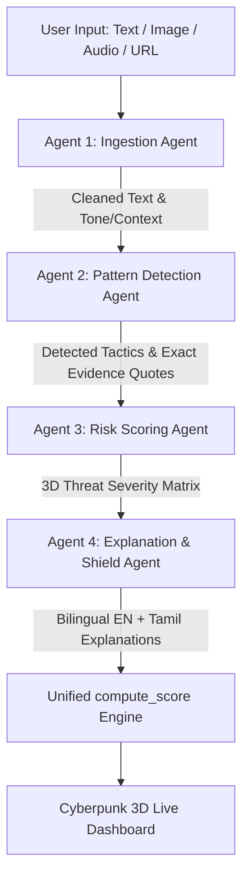

# 🛡️ MindShield AI

> **"Emotions beat logic. But that emotion should not become a weakness."**

---

### 🚀 Human-Layer Cybersecurity Powered by Google ADK & Gemini 2.5 Flash

**MindShield AI** is an advanced 4-Agent AI system designed to detect and expose **psychological manipulation, social engineering, and cognitive fraud** in real-time text, images, audio, and web URLs.

Instead of targeting traditional software vulnerabilities, MindShield AI protects the ultimate target: **the human layer**.

---

## 🌟 Key Capabilities

- 🤖 **4-Agent Sequential Intelligence Pipeline:** Built on **Google ADK (Agent Development Kit)** and **Gemini 2.5 Flash**.
- 🛡️ **8 Manipulation Categories:** Gaslighting, False Urgency, Coercion, Impersonation, Love Bombing, Fear Induction, Authority Fabrication, Social Engineering.
- 📐 **3D Risk Matrix:** Assigns granular 0–100 severity scores across 3 human threat axes:
  1. *Emotional Manipulation*
  2. *Deception & Lies*
  3. *Pressure & Coercion*
- 🌐 **Native Bilingual Support (English + Tamil):** Explains complex manipulation tactics in plain, accessible language in both English and Tamil.
- 🔒 **Zero-Storage Privacy:** 100% in-memory stateless processing — user content is analyzed and immediately purged without persistence.
- ⚡ **Offline Fail-Safe Engine:** Fallback rule engine with local signature matching if cloud APIs are offline.

---

## 🏗️ 4-Agent Architecture (Google ADK)



1. **Ingestion Agent:** Normalizes raw input, extracts tone, language, word count, and sender context.
2. **Pattern Detection Agent:** Scans for cognitive exploitation tactics and extracts **exact evidence quotes** as proof.
3. **Risk Scoring Agent:** Evaluates pattern severity into a 3D risk matrix (Emotional, Deception, Coercion).
4. **Explanation & Shield Agent:** Translates findings into plain English & Tamil with protective advice.

---

## 💻 Local Quickstart

### 1. Clone & Install
```bash
git clone https://github.com/thamaraiselvan-tech/MindShield-AI.git
cd MindShield-AI
pip install -r requirements.txt
```

### 2. Configure Environment
Create a `.env` file in the project root:
```env
GEMINI_API_KEY=your_gemini_api_key_here
DEBUG=False
```

### 3. Launch Development Server
```bash
python manage.py runserver
```
Navigate to **`http://127.0.0.1:8000/`** to experience the live 3D dashboard!

---

## 🧪 Running Unit Tests

```bash
python manage.py test
```

---

## 📜 License

Distributed under the [MIT License](LICENSE).