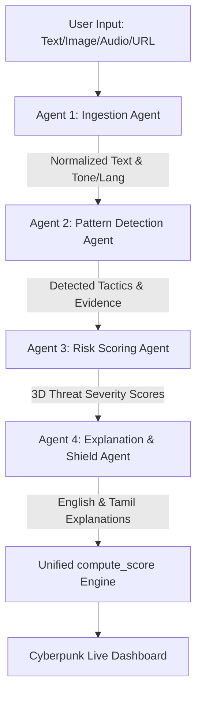

# Upgrading MindShield AI: A Google ADK & Gemini Multi-Agent Psychological Shield

*Submission for the Gen AI Academy APAC "Meet the Builders" Program*

> **"Emotions beat logic. But that emotion should not become a weakness."**

In an era dominated by instant messaging, phishing emails, and social engineering, psychological manipulation has become the primary vector for cyber fraud and misinformation. Tactics like **gaslighting, artificial urgency, fake authority, and emotional guilt-tripping** are engineered to bypass logical thinking and force immediate action.

To combat this, we built **MindShield AI** — a privacy-first, multimodal system designed to analyze digital communications and explain manipulation tactics in simple, layperson terms. Today, we are excited to showcase the massive upgrade of MindShield AI into a **production-grade Multi-Agent System** powered by **Google ADK (Agent Development Kit)** and **Gemini 2.5 Flash Lite**.

---

## 🏗️ The Multi-Agent Architecture

Rather than relying on a single large language model prompt to analyze, score, translate, and explain complex text, MindShield AI decomposes the task into a **4-agent sequential pipeline** using the **Google Agent Development Kit**. This ensures high reliability, modularity, and specialized capabilities.



### 1. Ingestion Agent
*   **Role:** Cleans, normalizes, and structures incoming text.
*   **Specialty:** Extracts metadata including the message's primary tone (e.g. urgent, aggressive), language, length, and inferred sender context.

### 2. Pattern Detection Agent
*   **Role:** Performs cognitive pattern analysis on the cleaned text.
*   **Specialty:** Maps specific psychological manipulation tactics (such as gaslighting, love bombing, or false authority) to exact evidence quotes within the input.

### 3. Risk Scoring Agent
*   **Role:** Analyzes the detected tactics to produce a multi-dimensional risk matrix.
*   **Specialty:** Outputs 0-100 severity scores across 3 distinct human threat axes:
    1.  *Emotional Manipulation*
    2.  *Deception & Lies*
    3.  *Pressure & Coercion*

### 4. Explanation & Shield Agent
*   **Role:** Formulates protective recommendations.
*   **Specialty:** Translates complex security findings into clear, layperson-friendly summaries and actionable shield advice in both **English** and **Tamil** using Gemini's native multilingual abilities.

---

## ⚡ Key Technical Innovations

### 1. Live Agent Execution Streaming (NDJSON)
Multi-agent pipelines can take several seconds to execute. To ensure a fluid user experience, the backend exposes a streaming endpoint using Django's `StreamingHttpResponse`.
As each agent completes its specialized task, it yields a JSON status line (NDJSON format). The frontend uses a `ReadableStream` reader to parse these lines in real-time, animating a **live timeline** that reveals exactly what each agent is thinking and doing.

### 2. Unified Scoring Authority
To maintain strict correctness, we designed a mathematical scoring module (`compute_score`). Rather than trusting LLM scores blindly, the pipeline blends the Risk Scoring Agent's 3D outputs with regex-based pattern matches (55+ pre-defined scam signatures) and structural signals (e.g. lookup spoofs, lookalike unicode characters, missing SSL).
The final score dynamically applies confidence penalties for low-quality inputs (such as noisy audio or blurry image OCR).

### 3. Zero-Storage Privacy
MindShield AI is built from the ground up to be **privacy-first**.
*   All data is processed strictly in-memory.
*   There are no databases, user registrations, or persistent logs.
*   User data is analyzed and discarded instantly, satisfying the highest data-privacy standards.

---

## 🎨 Futuristic Cyberpunk Interface

The frontend has been overhauled with a custom cyberpunk security aesthetic using **Vanilla CSS**:
*   **Agent Execution Timeline:** Shows the real-time active status, complete with pulsing icons, glow effects, and micro-animations for each stage.
*   **3D Risk Score Dashboard:** A harmonized grid showing individual bars and border colors that update dynamically based on the severity of Emotional, Deceptive, and Coercive tactics.
*   **Bilingual Cards:** Clear side-by-side or stacked explanations in both English and Tamil so anyone can instantly understand the threat.

---

## 🚀 Getting Started

To run MindShield AI locally:

1.  **Clone and Install:**
    ```bash
    git clone https://github.com/thamaraiselvan-tech/MindShield-AI.git
    cd MindShield-AI
    pip install -r requirements.txt
    ```
2.  **Configure API Key:**
    Set your Gemini API key in your environment or in a `.env` file:
    ```bash
    # Windows
    set GEMINI_API_KEY=your_gemini_key
    ```
3.  **Start Django:**
    ```bash
    python manage.py runserver
    ```
4.  Open `http://127.0.0.1:8000` to witness the multi-agent team in action!
